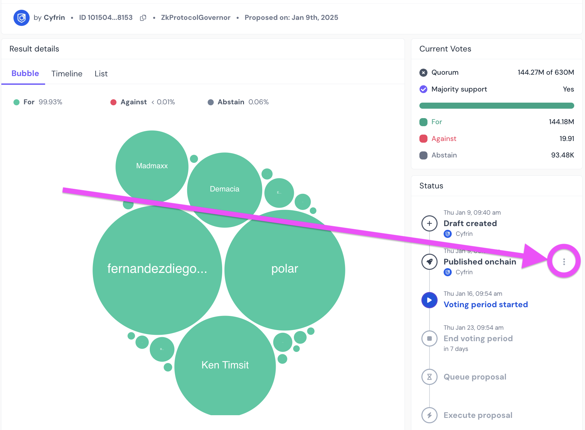
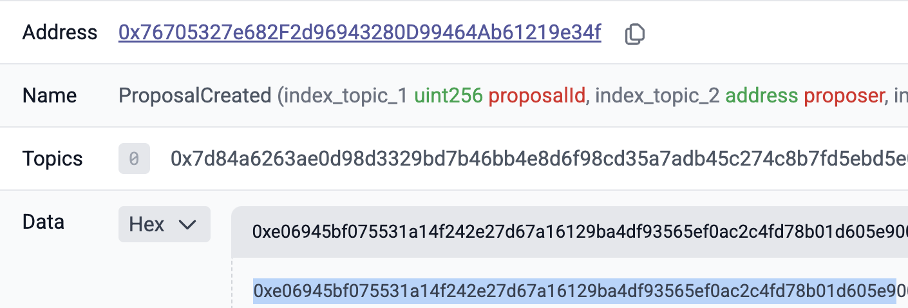
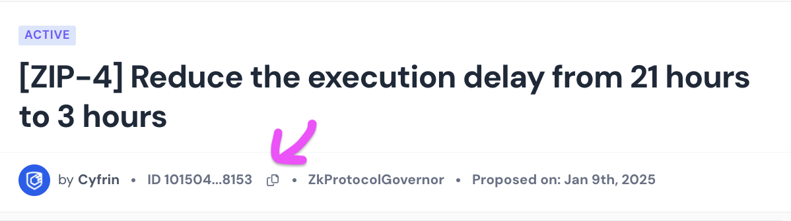
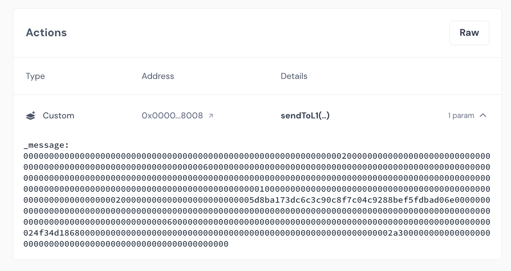

# ZKsync Upgrade Verification

This repo is aimed at doing two things:

1. Helping the ZKsync security council verify a proposal "looks correct" so that voting and upgrading can be fast and not a "last minute thing"
2. Having the security council confirm the calldata of the proposed transactions is correct before they are voted on by the delegates, as most of the delegates are not technical.
3. And finally, it outlines one way to [verify an upgrade's proposal integrity](https://github.com/zksync-association/zksync-upgrade-verification-tool/tree/main/apps/web/docs/standardUpgradeDocs#step-3-verify-upgrade-proposal-integrity) as outlined in the [ZKsync upgrade documentation](https://github.com/zksync-association/zksync-upgrade-verification-tool/tree/main/apps/web/docs/standardUpgradeDocs). *It's important we don't all use the same methodology, so, try to fork this and come up with your own, modify this process, etc.*

> [!NOTE]
> If you want a wholistic understanding of how DAOs and proposals work, please see the [Cyfrin Updraft DAO curriculum](https://updraft.cyfrin.io/courses/advanced-foundry/daos/introduction-to-dao).


- [ZKsync Upgrade Verification](#zksync-upgrade-verification)
- [Getting Started](#getting-started)
  - [Prerequisites](#prerequisites)
    - [Remix Prerequisites](#remix-prerequisites)
    - [Foundry Prerequisites](#foundry-prerequisites)
  - [Setup](#setup)
    - [Remix Setup](#remix-setup)
    - [Foundry Setup](#foundry-setup)
- [Step-by-step Instructions - Before a proposal passes a vote](#step-by-step-instructions---before-a-proposal-passes-a-vote)
  - [1. Read the proposal](#1-read-the-proposal)
  - [2. Get the transaction the proposed it](#2-get-the-transaction-the-proposed-it)
  - [3. Get the proposal ID](#3-get-the-proposal-id)
  - [4. Verifying sendToL1](#4-verifying-sendtol1)
- [Step-by-step Instructions - After a proposal passes](#step-by-step-instructions---after-a-proposal-passes)


# Getting Started

## Prerequisites

You have two options on how to use this repo:

### Remix Prerequisites

For using this with remix, you need only an internet connection and a browser.

### Foundry Prerequisites

- [git](https://git-scm.com/book/en/v2/Getting-Started-Installing-Git)
  - You'll know you did it right if you can run `git --version` and you see a response like `git version x.x.x`
- [foundry](https://getfoundry.sh/)
  - You'll know you did it right if you can run `forge --version` and you see a response like `forge 0.2.0 (816e00b 2023-03-16T00:05:26.396218Z)`

## Setup

### Remix Setup

Click [this link](https://remix.ethereum.org/#url=https://github.com/Cyfrin/zksync-upgrade-verification/src/UpgradeCheckerFlat.sol) which will load `UpgradeCheckerFlat.sol` into remix.

### Foundry Setup

```
git clone https://github.com/Cyfrin/zksync-upgrade-verification
cd zksync-upgrade-verification
forge build
```

# Step-by-step Instructions - Before a proposal passes a vote 

## 1. Read the proposal

So first off, we want to read the proposal and understand what it's doing at a high level. We want to make sure that it's something people we trust are voting on, and something that someone we trust has proposed. 

Most important, we should go over the audit report and make sure it is high quality. If anything fishy stands out, we should flag it. 

For example, here is [ZIP-4](https://www.tally.xyz/gov/zksync/proposal/101504078395073376090945455670282351844085476168544993296976152194429222258153?govId=eip155:324:0x76705327e682F2d96943280D99464Ab61219e34f), we'd read it.

## 2. Get the transaction the proposed it

Take a proposal like [ZIP-4](https://www.tally.xyz/gov/zksync/proposal/101504078395073376090945455670282351844085476168544993296976152194429222258153?govId=eip155:324:0x76705327e682F2d96943280D99464Ab61219e34f). We want to start with the transaction that initialized this proposal. Click the three dots next to the `Published onchain` section of the Tally UI, and view on block explorer. 

<p align="center">
        </a>
</p>

If you're a total badass, you can just get the transaction hash and use whatever tools you want from this point. 

## 3. Get the proposal ID

In that transaction, you'll get a proposal ID under the `ProposalCreated` log. For ZIP3 example:

<p align="center">
        </a>
</p>

The proposal ID here, is:
```
0xe06945bf075531a14f242e27d67a16129ba4df93565ef0ac2c4fd78b01d605e9
```

Ideally, we don't trust the Tally UI, but we can check the proposal ID in the transaction that proposed the vote to the Tally UI. To get the number edition, we just convert the hex back to numeric:

```
cast to-base 0xe06945bf075531a14f242e27d67a16129ba4df93565ef0ac2c4fd78b01d605e9 dec
```

Which is:
```
101504078395073376090945455670282351844085476168544993296976152194429222258153
```

Which should match Tally.

<p align="center">
        </a>
</p>

## 4. Verifying sendToL1

Probably the most important pre-vote step is to verify the `sendToL1` data looks good, or is what we expect. Essentially, all we need to do is take the calldata, and decode it. When we send a message to L1, we are calling this function:

```javascript
function execute(UpgradeProposal calldata _proposal) external payable;
```

On the [ProtocolUpgradeHandler](https://etherscan.io/address/0x8f7a9912416e8AdC4D9c21FAe1415D3318A11897#code)

Knowing this, it's pretty easy to "see" what the calldata is doing. For example in ZIP-4:

<p align="center">
        </a>
</p>

We can see the calldata here. All we need to do, is decode it with `cast decode-calldata "execute(((address,uint256,bytes)[],address,bytes32))"` and the calldata. EXCEPT, we have to remember to append `a1dcb9b8`, since that's the function selector for the `execute` function.

```
cast decode-calldata "execute(((address,uint256,bytes)[],address,bytes32))"  0xa1dcb9b80000000000000000000000000000000000000000000000000000000000000020000000000000000000000000000000000000000000000000000000000000006000000000000000000000000000000000000000000000000000000000000000000000000000000000000000000000000000000000000000000000000000000000000000000000000000000000000000000000000000000000000000000000000100000000000000000000000000000000000000000000000000000000000000200000000000000000000000005d8ba173dc6c3c90c8f7c04c9288bef5fdbad06e000000000000000000000000000000000000000000000000000000000000000000000000000000000000000000000000000000000000000000000000000000600000000000000000000000000000000000000000000000000000000000000024f34d18680000000000000000000000000000000000000000000000000000000000002a3000000000000000000000000000000000000000000000000000000000
```

This returns:

```
([(0x5D8ba173Dc6C3c90C8f7C04C9288BeF5FDbAd06E, 0, 0xf34d18680000000000000000000000000000000000000000000000000000000000002a30)], 0x0000000000000000000000000000000000000000, 0x0000000000000000000000000000000000000000000000000000000000000000)
```

Which, we can then map to the call parameters based on the struct:

```javascript
    struct Call {
        address target;    // 0x5D8ba173Dc6C3c90C8f7C04C9288BeF5FDbAd06E
        uint256 value;     // 0
        bytes data;        // 0xf34d18680000000000000000000000000000000000000000000000000000000000002a30
    }

    struct UpgradeProposal {
        Call[] calls;      // We only have 1 in the array, see the values above
        address executor;  // 0x0000000000000000000000000000000000000000
        bytes32 salt;      // 0x0000000000000000000000000000000000000000
    }
```

Which means we are going to call the `0x5D8ba173Dc6C3c90C8f7C04C9288BeF5FDbAd06E` address on Ethereum! Now, we can go one step further, and decode the data from calling that contract! We expect it to be changing the execution delay.

```
cast calldata-decode "setExecutionDelay(uint32)" 0xf34d18680000000000000000000000000000000000000000000000000000000000002a30
```

And we get a response of:

```
10800
```

Which is 3 hours, which means this looks great!

# Step-by-step Instructions - After a proposal passes 

*Coming soon...*