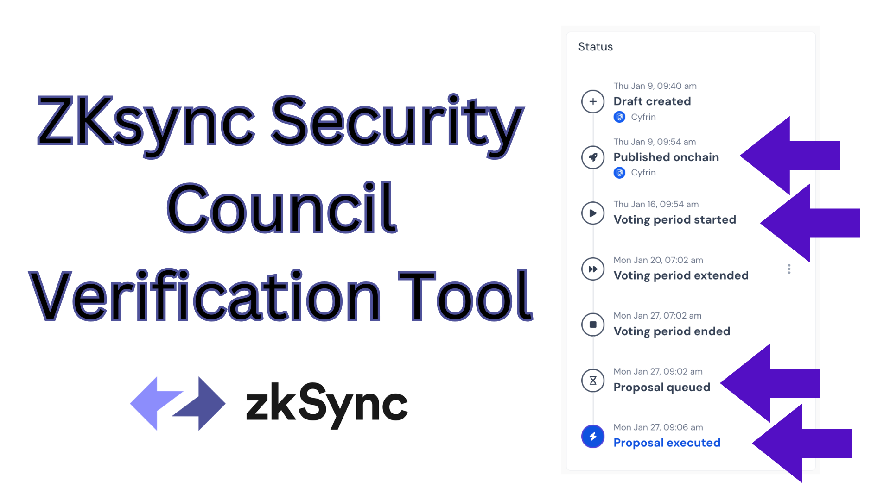

# ZKsync Upgrade Verification

What does the security council need to verify?

> Video Walkthrough

[](https://www.youtube.com/watch?v=c9Gv2XdxMq8)

## Security council responsibilities
1. Pre-vote
   1. Make sure the proposal makes sense 
      1. Is it audited? Does it need to be? By whom?
   2. Make sure the proposal ID in tally is correct
   3. Make sure the list of upgrade calldatas reflect what the proposal describes
2. Post-vote
   1. Make sure the ETH proposal ID is correct, approve it if so
   2. Make sure when you sign, your signature reflects the proposal ID

This repo and tool will help you do everything except `2.2` (coming soon...)

# Tool - Examples

You can run any of these. 

```bash
# ZIP-4 get all the calls based off the proposal transaction
zkgov_check get_upgrades 0x50e420474a6967eaac87813fe6479e98ae8d380fd9b3ae78bc4fedc443d9dec1 --rpc-url $ZKSYNC_RPC_URL
# ZIP-3 get the ZKsync proposal ID based off the transaction
zkgov_check get_zk_id 0x50e420474a6967eaac87813fe6479e98ae8d380fd9b3ae78bc4fedc443d9dec1 --rpc-url $ZKSYNC_RPC_URL
# ZIP-4 get the final ETH proposal ID based off the ZKsync proposal hash
zkgov_check get_eth_id 0x50e420474a6967eaac87813fe6479e98ae8d380fd9b3ae78bc4fedc443d9dec1 --rpc-url $ZKSYNC_RPC_URL
# This will give you the contracts to use in this repo
```

# Getting Started 

## Requirements

- [foundry (`cast` and `chisel` in particular)](https://getfoundry.sh/)
  - You'll know you did it right if you can run `cast --version` and you see a response like `cast 0.3.0 (41c6653 2025-01-15T00:25:27.680061000Z`
- [bash](https://www.gnu.org/software/bash/)
  - You'll know you have it if you run `bash --version` and see a response like `GNU bash, version 5....`
- `ZKSYNC_RPC_URL` environment variable - a connection to a ZKsync Era Node

## Installation

You can install the tool via CLI, or just clone the repo.

### Curl

```bash
curl -L https://raw.githubusercontent.com/cyfrin/zksync-upgrade-verification/main/install.sh | bash
```

### Source

You can run scripts directly from this repository.

```bash
git clone https://github.com/Cyfrin/zksync-upgrade-verification
cd zksync-upgrade-verification
```

# Quickstart

## Getting a proposal ID from a transaction 

Take a proposal like [ZIP-4](https://www.tally.xyz/gov/zksync/proposal/101504078395073376090945455670282351844085476168544993296976152194429222258153?govId=eip155:324:0x76705327e682F2d96943280D99464Ab61219e34f). We want to start with the transaction that initialized this proposal. Click the three dots next to the `Published onchain` section of the Tally UI, and view on block explorer. 

<p align="center">
        </a>
</p>

Get the transaction, and make sure the Tally UI matches with:

```bash
zkgov_check get_zk_id 0x5e7ef52948f372de0a64c19e76a30313f2b6b1e4b4b63791eb0fcac68a565604 --rpc-url $ZKSYNC_RPC_URL
```

You'll get:
```
Proposal ID
Hex: 0xe06945bf075531a14f242e27d67a16129ba4df93565ef0ac2c4fd78b01d605e9
Decimal: 101504078395073376090945455670282351844085476168544993296976152194429222258153
```

And the `Decimal` is correct.

## Getting the list of ZKsync and Ethereum transactions

A DAO proposal is a list of targets, values, and calldatas. We should verify what targets we are calling with what calldata. There are special cases, when we call `sendToL1(bytes)`. When we do this, we are likely performing an Upgrade. An Upgrade can consist of many targets, values, and calldatas themselves, so we want to check those out. You can see the exhaustive list of ZKsync transactions (and, if they call `sendToL1`, the corresponding Ethereum transactions) with:

```bash
zkgov_check get_zk_id 0x50e420474a6967eaac87813fe6479e98ae8d380fd9b3ae78bc4fedc443d9dec1 --rpc-url $ZKSYNC_RPC_URL
```

This will give an output like:

```
ZKsync Transactions

ZKsync Transaction #1:
Target Address: 0x0000000000000000000000000000000000008008
Value: 0
Calldata: 0x62f84b24000000000000000000000000000000000000000000000000000000000000002000000000000000000000000000000000000000000000000000000000000001800000000000000000000000000000000000000000000000000000000000000020000000000000000000000000000000000000000000000000000000000000006000000000000000000000000000000000000000000000000000000000000000000000000000000000000000000000000000000000000000000000000000000000000000000000000000000000000000000000000000000000000000000000000100000000000000000000000000000000000000000000000000000000000000200000000000000000000000005d8ba173dc6c3c90c8f7c04c9288bef5fdbad06e000000000000000000000000000000000000000000000000000000000000000000000000000000000000000000000000000000000000000000000000000000600000000000000000000000000000000000000000000000000000000000000024f34d18680000000000000000000000000000000000000000000000000000000000002a3000000000000000000000000000000000000000000000000000000000
(ETH transaction)

Ethereum Transaction #1

  Call:
    Target: 0x5D8ba173Dc6C3c90C8f7C04C9288BeF5FDbAd06E
    Value: 0
    Calldata:  0xf34d18680000000000000000000000000000000000000000000000000000000000002a30

Executor: 0x0000000000000000000000000000000000000000
Salt: 0x0000000000000000000000000000000000000000000000000000000000000000
```

## Verify the ETH proposal ID

The proposal ID on Ethereum is different from the one on ZKsync, but we can generate it and make sure it's the same one by hashing the values the same way we do on Ethereum. As of today this is a two step process, because I am coding at 1 in the morning. If someone wants to make this a one step process, please make a PR!

```
zkgov_check get_eth_id 0x5e7ef52948f372de0a64c19e76a30313f2b6b1e4b4b63791eb0fcac68a565604 --rpc-url $ZKSYNC_RPC_URL
```

This will give an output like:

```solidity
/*//////////////////////////////////////////////////////////////
                              CONTRACT 1
//////////////////////////////////////////////////////////////*/
// SPDX-License-Identifier: MIT
pragma solidity ^0.8.3;

import {IProtocolUpgradeHandler} from "src/interfaces/IProtocolUpgradeHandler.sol";
import {Test, console} from "forge-std/Test.sol";

contract ZIPTest_eth_1 {
    bytes32 public salt = 0x0000000000000000000000000000000000000000000000000000000000000000;
    IProtocolUpgradeHandler.Call[] public calls;

    IProtocolUpgradeHandler.Call call1 = IProtocolUpgradeHandler.Call({
        target: 0x5D8ba173Dc6C3c90C8f7C04C9288BeF5FDbAd06E,
        value: 0,
        data: hex"f34d18680000000000000000000000000000000000000000000000000000000000002a30"
    });

    constructor() {
        calls.push(call1);
    }

    function getHash() public view returns (bytes32) {
        IProtocolUpgradeHandler.UpgradeProposal memory upgradeProposal = IProtocolUpgradeHandler.UpgradeProposal({
            calls: calls,
            salt: salt,
            executor: 0x0000000000000000000000000000000000000000
        });
        return keccak256(abi.encode(upgradeProposal));
    }
}
contract TestZIPEth_1 is Test {
    ZIPTest_eth_1 zip;

    function setUp() public {
        zip = new ZIPTest_eth_1();
    }

    function testZIPEthProposalId_1() public view {
        bytes32 hash = zip.getHash();
        console.logBytes32(hash);
    }
}
```

```console
Total ETH transactions (and therefore, contracts): 1
Please copy paste the contract you're looking for the signature for into the test folder, and run the main test with:
  forge test --mt getHash --mc (contract_name) -vv
```

You can then copy the `solidity` code into the `test` folder, and run the test that was given to you to see the resulting signature.

```
forge test --mt testZIPEthProposalId_1 --mc TestZIPEth_1 -vv
```

# Trust Assumptions
- Bash
- Foundry
- My code
- Your ZKsync RPC URL

# Signature Verification

Right now, this tool doesn't show you the hash that should show up on your wallet when you sign off on the proposals. I will add that in soon. 


# Thank you!
